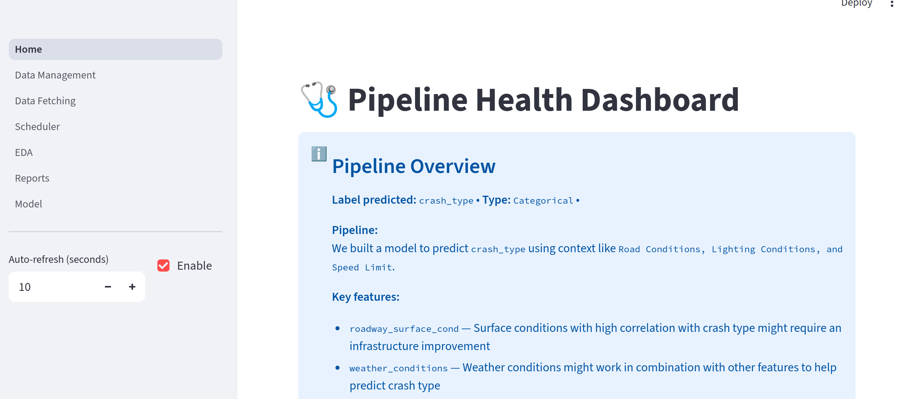
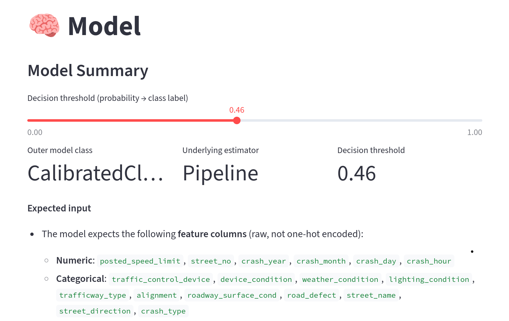
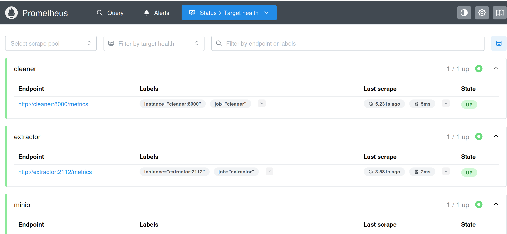
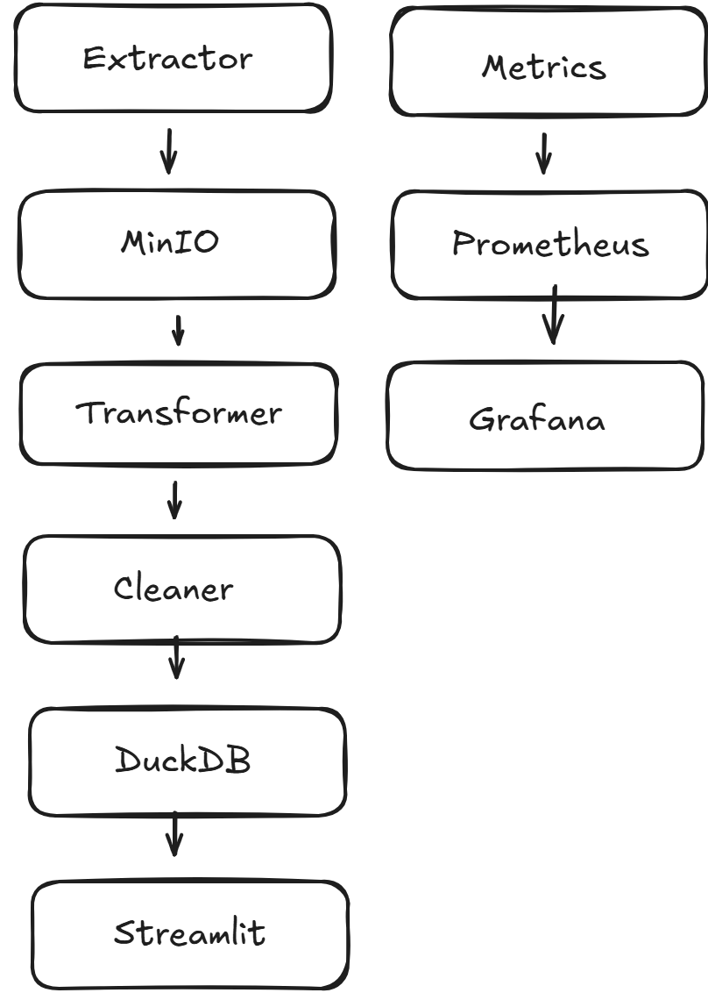

# Chicago Crash ML Pipeline (Extractor → MinIO → Silver → DuckDB Gold → Streamlit)

A containerized, end-to-end data engineering + ML system that pulls Chicago traffic crash data from public APIs, processes it through a multi-stage pipeline, and serves a trained machine learning model through an interactive Streamlit application. The stack also includes full observability with Prometheus metrics and Grafana dashboards.

---

## 1) Objectives

### The problem it solves
Chicago crash records are spread across multiple related datasets (crashes, vehicles, and people). On their own, these tables are hard to use for analysis or machine learning because they require consistent keys, joining logic, and careful cleaning. This project automates the process of collecting the data, building a clean analytics-ready dataset, and training a model that predicts crash outcomes.

### APIs / datasets used
This pipeline pulls data from the Chicago Data Portal (Socrata Open Data API). It retrieves crash-level records and related vehicle/person tables, then consolidates them into a single usable dataset.

### How data moves through the system
1. **Extractor (Go)** downloads raw data from the API and stores it in **MinIO** (object storage).
2. **Transformer (Python)** reads raw files and produces cleaned/merged **Silver** CSV outputs.
3. **Cleaner (Python)** applies stricter cleaning rules and writes a **Gold** dataset into **DuckDB** for fast querying.
4. **Streamlit** loads the Gold tables, trains an ML model, and supports interactive predictions and visual analytics.
5. **Monitoring** runs continuously: each service exposes metrics which **Prometheus** scrapes and **Grafana** visualizes.

### What the ML model predicts
The model predicts **Crash Type**, for example:
- whether a crash is **high severity**
- whether a crash results in **injury/fatality**
- or another defined label derived from the Gold dataset

The prediction is intended for decision support (dashboards, triage, analysis), not automated enforcement.

### What the Streamlit app can do
The Streamlit UI provides:
- dataset exploration (filters, summary stats, EDA)
- model training and evaluation (metrics, thresholding, comparisons)
- predictions on new inputs or selected records
- visualizations and reports powered by the Gold DuckDB tables

---

## 2) Pipeline components (walkthrough)

### Extractor (Go)
The extractor pulls crash, vehicle, and person data from the Socrata API and writes the results into MinIO as raw objects. It is designed to support repeatable ingestion (streaming or backfill) and exposes Prometheus metrics for request counts, failures, and latency. This stage is responsible for reliable data acquisition and raw-layer persistence.

### Transformer (Python)
The transformer reads raw objects from MinIO, performs joins/merges across crash-vehicle-person tables, and applies lightweight cleaning and normalization. It outputs “Silver” CSVs that are consistent, typed, and ready for downstream processing. This stage focuses on building an integrated analytical dataset without enforcing final “Gold” quality constraints.

### Cleaner (Python)
The cleaner applies stricter cleaning rules, feature engineering, and quality checks (e.g., missing value handling, type enforcement, deduplication policies). It writes the finalized “Gold” dataset into DuckDB, creating tables that are optimized for fast queries from Streamlit and notebooks. This is the authoritative layer used for modeling and reporting.

### Streamlit app
The Streamlit app provides an interactive interface to the Gold DuckDB database. It supports training an ML model on the engineered features, evaluating results, and generating predictions. It also exposes visuals (EDA, metrics, and reports) to make the pipeline outputs usable for non-technical stakeholders.

### Docker Compose
Docker Compose orchestrates the entire environment: MinIO for storage, the pipeline services (extractor/transformer/cleaner), Streamlit for UI, and Prometheus + Grafana for monitoring. This ensures a reproducible setup where the whole pipeline can be started with a single command.

### Monitoring (metrics + dashboards)
Each service exposes a `/metrics` endpoint (Prometheus format). Prometheus scrapes these metrics, and Grafana dashboards visualize pipeline health: durations, row counts, error rates, and last-run timestamps. Monitoring is treated as a first-class part of the system to support debugging and operational reliability.

---

## 3) Screenshots

### Streamlit app
**Home**

**TModel**

### DuckDB tables

### Grafana dashboard

### Prometheus targets

---
## 4) Architecture

## 5) How to Run the Pipeline

This project is fully containerized using Docker Compose, allowing the entire pipeline to be launched and managed as a single system.

### Step 1: Clone the repository
git clone <YOUR_REPOSITORY_URL>
cd chicago-crash-ml-pipeline

### Step 2: Create the environment configuration

- Copy the provided example file and populate it with the required values (API tokens, dataset IDs, and credentials).

- cp .env.example .env

At minimum, this file must include:

- Chicago Data Portal (Socrata) API token and dataset identifiers

- MinIO credentials and bucket names

- DuckDB output path

- Grafana admin credentials

### Step 3: Create required local directories

These folders are mounted into the containers and allow inspection of intermediate and final data products.

- mkdir -p data/raw data/silver data/gold

### Step 4: Start the full system

Launch all services (pipeline stages, storage, UI, and monitoring) with a single command:

- docker compose up -d

Docker Compose will start:

- MinIO object storage

- Extractor, Transformer, and Cleaner services

- Streamlit application

- Prometheus metrics server

- Grafana dashboard service

### Step 5: Access running services

- Once the containers are running, the following interfaces are available:

- Streamlit application: http://localhost:8501

- Grafana dashboards: http://localhost:3000

- Prometheus UI: http://localhost:9090

- Grafana is preconfigured to read metrics from Prometheus, which scrapes the pipeline services automatically.

### Step 6: Execute the pipeline

Depending on configuration, pipeline stages can be triggered via:

- Streamlit controls

- API endpoints exposed by the extractor

- Container startup jobs or scheduled runs

A typical workflow is:

- Run the Extractor to pull raw data into MinIO

- Run the Transformer to produce Silver datasets

- Run the Cleaner to generate Gold DuckDB tables

- Use Streamlit to train models and generate predictions

---

## 6) Improvements and Extra Features

In addition to the core pipeline requirements, several enhancements were implemented to improve reliability, usability, and analytical depth:

End-to-end observability:
- Each pipeline component exposes Prometheus metrics for latency, error counts, and row throughput, enabling real-time monitoring.

Rows-in / rows-out tracking:
- Metrics were added to detect stalled or incomplete ETL stages and validate data flow integrity.

Custom Grafana dashboards:
- Dashboards visualize pipeline health, processing duration, error rates, and last successful run timestamps.

Gold-layer DuckDB storage:
- A DuckDB Gold layer enables fast analytical queries and seamless integration with Streamlit and notebooks.

Streamlit model workflow:
- The UI supports model training, evaluation, and prediction rather than serving only static visualizations.

Feature engineering and data validation:
- Additional cleaning logic and derived features were added during the Cleaner stage to improve model stability and performance.

These enhancements demonstrate a focus on production-grade design rather than a one-off script-based solution.

## 7) Lessons Learned and Challenges

Designing a multi-service pipeline highlighted the importance of clear data contracts between stages.

Managing container networking and environment variables was a frequent source of early errors.

Using the VM created numerous problems to be tackled in conjuction with problems within the scope of the project.

The multitude of tools to be used in harmony was difficult to fully utilize to a perfect degree.

With more time, the system could be extended with automated data quality checks, alerting rules, and CI-based testing.

This project reinforced best practices in data engineering, reproducibility, and ML system design, and provided hands-on experience building an observable, end-to-end pipeline.
